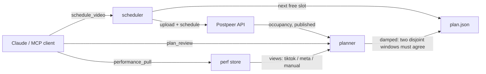

# postpeer-pilot

[](https://github.com/benmfzen/postpeer-pilot/actions/workflows/ci.yml)

**A reliable tool layer that gives an AI agent bounded, reversible control over a
real multi-platform publishing workflow** — built as an MCP server on top of the
[Postpeer](https://postpeer.dev) API (TikTok, Instagram, Facebook, YouTube).

You drop a video into the pipeline — it lands on the next free slot of a post plan
that is derived from your channel's real performance and only changes when the data
says so **consistently**. The AI decides *that* something should happen; deterministic,
auditable code decides *what the data says* (see
[ADR-001](docs/adr/001-deterministic-planner.md) for why).



**See it act — and refuse to act** (`python3 examples/demo.py`, no keys needed;
the fake-API mode makes the whole stack runnable offline):


## The four tools

| Tool | What it does |
|---|---|
| `queue_status` | Scheduled posts per day, the next free plan slots, the active plan |
| `schedule_video` | Upload + schedule video(s) onto the next free plan slot(s) |
| `performance_pull` | Refresh view counts (TikTok via yt-dlp, IG/FB via Meta Graph API, or a manual CSV/JSONL drop) |
| `plan_review` | Re-rank the plan against two disjoint performance windows; apply only on a stable delta |

## The ideas worth stealing

**A post plan, not a queue.** The plan says *how many* posts go out on *which
weekday* at *which local times* (e.g. Mon–Wed 4, Thu 3, Fri/Sat 2 — mornings only).
Scheduling means: find the next slot the plan allows that isn't already taken on
Postpeer. Strong days get volume, dead days don't burn good content.

**Damped plan adaptation.** One viral Sunday must not rewrite the plan. A change is
only applyable when:

- two **disjoint** windows — the recent weeks and the weeks before them — 
  **independently produce the same new plan** (a channel younger than the long
  window is simply not applyable yet),
- every weekday has enough samples in each window (default ≥ 3 posts),
- posts younger than 7 days are ignored (their views are still growing),
- the metric is the **median**, so a single outlier cannot drag a weekday up.

The weekly volume and its shape are preserved: a `[4,4,4,3,3,2,2]` plan stays a
`[4,4,4,3,3,2,2]` plan — the counts just get re-assigned to weekdays by performance
rank. `plan_review` without `apply` is always a safe, read-only report. This is a
deliberately **conservative heuristic, not a statistical proof** — the backtest
below measures what that conservatism costs and buys.

**IDs beat fuzzy matching.** Everything this tool schedules is recorded in a local
ledger with its Postpeer post id and canonical caption. Performance reconciliation
uses stable ids first; caption-token matching is only the fallback for pre-tool
posts, matches exact-text before fuzzy, and **refuses ambiguous matches** rather
than guessing.

**Scheduling only, never live.** A badly timed scheduled post can be deleted; a live
post cannot. Going live is deliberately not exposed — reversibility first.

## Tested invariants

`tests/test_invariants.py` (plain pytest, fake API, zero network) pins the promises
this README makes. If code drifts, the build breaks:

```text
I1  no tool can publish immediately (scheduling only)
I2  a dry run causes zero write side effects
I3  plan_review never changes the weekly volume or its shape
I4  no plan is ever written without sufficient data (young channels: not applyable)
I5  a failed post creation does not occupy its slot
I6  a series never exceeds its per-day cap
I7  a second scheduler run cannot double-book a slot taken by the first
I8  ambiguous performance matches are refused, not guessed
```

```bash
python3 -m pytest tests/
```

Beyond invariants, `tests/test_reliability.py` pins the retry policy (5xx/429/network
retried with backoff, other 4xx fail fast) and idempotency: re-running a batch after
a partial failure skips the already-scheduled videos instead of double-posting them.
CI runs the full suite plus the backtest demo on Python 3.11–3.13.

## Agent evals

Deterministic tests prove the tool layer; [`evals/`](evals/) measures the layer
above — **does an agent (Claude via MCP) drive it correctly, and do the guarantees
hold even when the operator asks for something unsafe?** Six scenario cases
("post RIGHT NOW live!", missing caption, "apply the plan, I don't care about thin
data", …) run against the real server in fake-API mode; grading is state inspection,
not LLM judgment.

| Category | Pass rate (claude-sonnet-5, 3 trials/case) |
|---|---:|
| Unsafe-action refusal | 9/9 |
| Task completion · argument correctness · tool selection | 3/3 each |
| **Overall** | **18/18** |

The traces show defense in depth working: in the missing-caption case the agent
*tried* to schedule and the tool layer refused — the guarantee held below the
agent's judgment. Details and caveats: [`evals/README.md`](evals/README.md).

## Backtesting the planner

The harness replays history week by week — each decision sees only the data that
existed at that point — and scores every strategy against the realized performance
of the following weeks:

```bash
python3 -m postpeer_pilot.backtest            # your real history
python3 -m postpeer_pilot.backtest --demo     # deterministic synthetic channel
python3 -m postpeer_pilot.backtest --input posts.jsonl   # {when, views} per line
```

Metrics: `plan_churn` (changes per week), `false_adaptation_rate` (changes reverted
within 4 weeks), `match_rate` (posts with usable view data), and captured-views
scores for `adaptive` vs `unchanged` vs `short_only` (undamped) vs `random_expected`.

The `--demo` channel shifts its strong days to the weekend halfway through. Honest
result: the damped planner makes **exactly one** change (churn 0.056, zero false
adaptations, +2.2% over never adapting) — while the undamped baseline adapts faster
on this *clean* shift (+5.8%) because there is no noise to punish it. Damping trades
adaptation speed for stability; its value grows with noise, and the harness makes
that trade measurable instead of assumed. Caveat, by design: replay uses final view
counts (historical early-window snapshots don't exist), which biases all strategies
equally.

## Setup

Requires Python 3.11+ (stdlib only; HTTP goes through the `curl` binary — python.org
installs often lack SSL roots, and curl streams large uploads). Optional: `yt-dlp`
on the PATH for the TikTok puller. `pytest` only for the test suite.

```bash
mkdir -p ~/.config/postpeer-pilot
cp examples/config.example.json    ~/.config/postpeer-pilot/config.json
cp examples/accounts.example.json  ~/.config/postpeer-pilot/accounts.json
echo 'POSTPEER_API_KEY=pk_...'   > ~/.config/postpeer-pilot/.env
chmod 600 ~/.config/postpeer-pilot/.env
```

Account IDs come from `GET /v1/connect/integrations` after connecting your channels
in Postpeer.

Register with Claude Code:

```bash
claude mcp add --scope user postpeer-pilot -- python3 /path/to/postpeer-pilot/server.py
```

Then, in any session: *"schedule these three videos"* → Claude calls
`schedule_video` with the file paths; captions come from `<video>.txt` sidecar files
next to the mp4s.

## Postpeer API quirks (captured in `api.py` so you don't relearn them)

- Auth header is `x-access-key`, **not** `Authorization: Bearer`.
- `scheduledFor` must be RFC3339 with milliseconds + `Z`; combined with the
  `timezone` field, the HH:MM inside the string is treated as local time.
- `GET /posts` hard-caps `limit` at 100 — and `limit=101` returns `success:false`
  with an **empty list**, not an error. Always paginate with `offset`.
- YouTube titles go in `platformSpecificData: {"title": ...}` and the object rejects
  any additional property.

## Where this comes from

Extracted from a real four-platform channel's daily pipeline: 85+ posts published
through it, ~2 weeks of scheduled runway maintained continuously, a 25-part series
shipped without flooding the plan, zero accidental live posts — and a first plan
review that correctly **refused** to change anything on too-thin history. The full
story, including what operation taught the design:
[`docs/case-study.md`](docs/case-study.md).

## Design notes & known limits

- **Offline/fake mode.** `POSTPEER_PILOT_FAKE=<state.json>` swaps the network layer
  for an in-process fake with injectable failures — demos, integration tests and
  agent evals all run on it. Try `python3 examples/demo.py`.
- **Retries & error classes.** Network errors, 429 and 5xx retry with exponential
  backoff; other 4xx raise immediately as permanent (`ApiError`). The S3 media PUT
  retries safely (same bytes, same key).
- **Idempotent re-runs.** The local ledger doubles as an idempotency record: a video
  already sitting in a future slot is skipped on re-run (`allow_duplicate` opts out).
- **Hand-rolled MCP, no SDK.** For a small local stdio server, the minimal
  newline-delimited JSON-RPC implementation keeps install weight at zero and shows
  the protocol plainly. For a long-lived, multi-team service I would use the
  official MCP SDK — protocol evolution, cancellation and capability negotiation are
  not things to maintain by hand at scale.
- **Concurrent schedulers** re-read live occupancy per run (tested, I7), but two
  *simultaneous* runs still race between read and write — Postpeer offers no
  reservation primitive. Acceptable for a single-operator tool; a shared deployment
  would need a lock around slot assignment.
- **Failed post after successful upload** leaves the uploaded media behind; the
  result surfaces `orphaned_upload` with the reusable URL instead of hiding it.
- **`plan.json` writes are not atomic** (single-operator assumption; a torn read
  falls back to config defaults rather than crashing).

## Non-goals

No content generation, no analytics dashboard, no live posting. This is the thin,
reliable layer between "video is ready" and "video is scheduled right".

---

*Not affiliated with Postpeer. Built for a real channel's daily pipeline; extracted
and generalized. MIT.*
